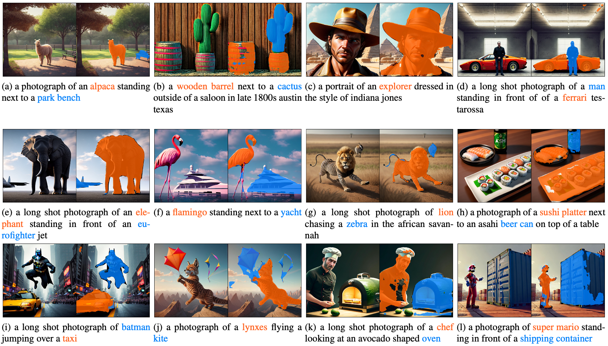
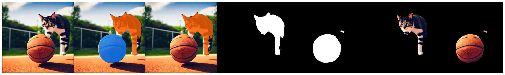

# Grounded Diffusers

This repository builds on top of the paper [Guiding Text-to-Image Diffusion Model Towards Grounded Generation
](https://arxiv.org/abs/2301.05221) whose code is available [here](https://github.com/Lipurple/Grounded-Diffusion) and re-implements it using the HuggingFace's [diffusers](https://github.com/huggingface/diffusers) library in addition to several improvements including:

- Decoupled dataset generation and training
- Support for multiple objects in an image
- Multi-epoch training
- Choice of loss function (BCE, Dice, Dice + BCE, Log-Cosh + BCE)

The details of our contribution are elaborated on in the [project's paper](https://github.com/WalterSimoncini/grounded-diffusers/blob/master/paper.pdf)

## Qualitative Results

The original image and the segmentation masks generated by our grounding model for one or two classes. The model is able to ground long tail objects such as a sushi platter, eurofighter, batman and super mario.




## Environment setup

To create a suitable environment to run the code install conda and create an environment as follows:

```sh
conda create --name gdiff python==3.10
sh setup_env.sh
```

The setup script will install the required dependencies and download Mask R-CNN and grounding checkpoints. The latter was trained on 10k images with two objects from different classes selected between the first 15 classes of the split 1 of Pascal VOC, located in `VOC/class_split1.csv`. The grounding module was trained using Stable Diffusion 1.5, so it's not compatible with Stable Diffusion 2.

## Running the code

### Generate & Segment

Once you've set up the environment you can generate and segment an image using the `generate_and_segment.py` script as follows:

```sh
python generate_and_segment.py \
    --prompt "a photograph of a basketball with a cat standing on top of it on a field long shot" \
    --classes "cat,basketball" \
    --grounding-ckpt "mmdetection/checkpoint/grounding_module.pth" \
    --seed 2147483647
```

This will output images overlayed with the masks generated by the segmentation module and Mask R-CNN, alongside the segmented items (using the segmentation module). The command above will generate the image and masks below



### Training a new module

To train a new grounding module you'll first have to generate a dataset using the `generate_dataset.py` script. You will need both a training and a validation dataset. At this time we are not able to offer the download of a mock dataset due to the size of an individual image (alongside its UNet features) being ~54 MBs. Run the script as follows:

```sh
# Use stabilityai/stable-diffusion-2 for Stable Diffusion 2
python generate_dataset.py \
    --output-dir "mock" \
    --n-classes 2 \
    --total-samples 50 \
    --dataset-type "seen" \
    --model-name "runwayml/stable-diffusion-v1-5"
```

This script will only save generated samples for which Mask R-CNN can find masks for both picked classes. Once you've generate a training and a validation dataset train the grounding module as follows:

```sh
# Use the --visualize-examples flag to display a mask every 25 steps
python train_grounding_multiclass.py \
    --dropout 0.2 \
    --n-epochs 10 \
    --run-name "mock" \
    --train-images-path "train/images/" \
    --train-samples-path "train/samples/" \
    --validation-samples-path "val/samples/" \
    --seed 42
```

Once you've trained the model you can use the `evaluate_multi_class.py` script to calculate the mIoU on a test dataset

```sh
python evaluate_multi_class.py \
    --grounding-ckpt "mmdetection/checkpoint/grounding_module.pth" \
    --model-name "runwayml/stable-diffusion-v1-5" \
    --samples-path "val/samples/"
```

## Miscellaneous

### Prompts to generate the poster images

```json
[
    {
        "prompt": "a photograph of a basketball with a cat standing on top of it on a field long shot",
        "classes": "cat,basketball"
    },
    {
        "prompt": "a photograph of a mug and a pottedplant side by side sitting on top of a table in a kitchen with strong natural light. In the background a white wall can be seen",
        "classes": "mug,pottedplant"
    },
    {
        "prompt": "a photograph of a monkey sitting side by side with a bunch of bananas. there is a strong natural warm light in the scene. high quality photography 8k",
        "classes": "monkey,banana"
    },
    {
        "prompt": "a photograph of a red car and an eagle flying in the sky",
        "classes": "eagle,car"
    },
    {
        "prompt": "a photograph of a dog sitting on top of a boat sailing on a river, lit by a warm natural light long shot",
        "classes": "dog,boat"
    }
]
```
